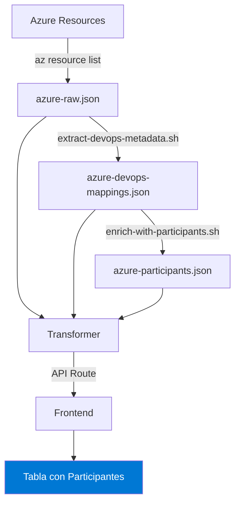

# Integración con Azure DevOps - Preguntas Frecuentes

## 🔍 Investigación y Hallazgos

### ¿Por qué hay recursos de Azure sin proyecto de Git configurado?

Al investigar el recurso `as-api-cl-agpsa-carpetadigitalcliente-netcore-prd` que mencionaste, encontramos que **SÍ tiene un proyecto configurado**, pero la información no siempre es visible mediante comandos estándar de Azure CLI.

#### Razones por las que un recurso puede no mostrar información de Git:

1. **Método de obtención incorrecto**:
   - `az webapp deployment source show` puede ser muy lento o no retornar información completa
   - La metadata de VSTSRM (Visual Studio Team Services Release Management) está en un endpoint diferente

2. **Tipo de deployment configurado**:
   - **Azure Pipelines (VSTSRM)**: Usa metadata especial que NO aparece en `deployment source`
   - **GitHub Actions**: Aparece en deployment source
   - **FTP/Manual**: No tiene información de Git
   - **Local Git**: Tiene deployment source pero sin URL remota útil

3. **Configuración del Deployment Center**:
   - Como viste en la captura, el App Service tiene Azure DevOps configurado en el Deployment Center
   - Esta configuración se almacena en la **metadata del App Service**, no en el deployment source

### ✅ Comando correcto para obtener información de Azure DevOps

```bash
# Obtener metadata del App Service (incluye info de VSTSRM)
az rest --method post \
  --uri "https://management.azure.com/subscriptions/{SUBSCRIPTION_ID}/resourceGroups/{RESOURCE_GROUP}/providers/Microsoft.Web/sites/{APP_NAME}/config/metadata/list?api-version=2022-09-01"
```

**Campos importantes en la respuesta**:
- `properties.VSTSRM_ProjectId` - ID del proyecto en Azure DevOps
- `properties.VSTSRM_BuildDefinitionId` - ID de la pipeline/build definition
- `properties.VSTSRM_BuildDefinitionWebAccessUrl` - URL para ver la pipeline
- `properties.VSTSRM_ConfiguredCDEndPoint` - Endpoint de CD configurado

#### Ejemplo de respuesta:

```json
{
  "properties": {
    "VSTSRM_ProjectId": "abc123-def456-ghi789",
    "VSTSRM_BuildDefinitionId": "42",
    "VSTSRM_BuildDefinitionWebAccessUrl": "https://dev.azure.com/Automotriz-Chile/proyecto/_build?definitionId=42",
    "VSTSRM_AccountName": "Automotriz-Chile"
  }
}
```

### 🔗 Obtener información del repositorio Git

Una vez que tenemos el `ProjectId` y `BuildDefinitionId`, usamos la API REST de Azure DevOps:

```bash
# Configurar variables
ORG="Automotriz-Chile"
PROJECT_ID="abc123-def456-ghi789"
BUILD_ID="42"
PAT="tu-personal-access-token"

# Obtener definición del build (incluye info del repo)
curl -u ":$PAT" \
  "https://dev.azure.com/$ORG/$PROJECT_ID/_apis/build/definitions/$BUILD_ID?api-version=7.0"
```

**Campos importantes en la respuesta**:
```json
{
  "repository": {
    "id": "repo-id",
    "name": "api-cl-agpsa-carpetadigitalclientes-netcore",
    "url": "https://dev.azure.com/Automotriz-Chile/proyecto/_git/repo-name",
    "type": "TfsGit",
    "defaultBranch": "refs/heads/main"
  }
}
```

### 👥 Obtener participantes del proyecto

Para obtener los usuarios que participan en el proyecto:

```bash
# 1. Obtener equipos del proyecto
curl -u ":$PAT" \
  "https://dev.azure.com/$ORG/_apis/projects/$PROJECT_ID/teams?api-version=7.0"

# 2. Obtener miembros del equipo principal
curl -u ":$PAT" \
  "https://dev.azure.com/$ORG/_apis/projects/$PROJECT_ID/teams/{TEAM_ID}/members?api-version=7.0"
```

**Respuesta incluye**:
```json
{
  "value": [
    {
      "identity": {
        "id": "user-guid",
        "displayName": "Juan Pérez",
        "uniqueName": "juan.perez@company.com",
        "imageUrl": "https://dev.azure.com/..."
      }
    }
  ]
}
```

## 🛠️ Implementación en el Dashboard

### 1. Cambios en la UI

#### Icono de Azure DevOps

Cambiamos el icono de Git Branch genérico por el icono específico de Azure DevOps cuando el provider es `azuredevops`:

```tsx
{resource.gitRepository.provider === 'azuredevops' ? (
  <DiVisualstudio className="h-5 w-5 text-[#0078D4]" />
) : (
  <GitBranch className="h-4 w-4 text-blue-600" />
)}
```

Color oficial de Azure DevOps: `#0078D4`

#### Columna de Participantes

Nueva columna que muestra avatares de los participantes del proyecto:

```tsx
<TableCell className="px-4 py-2">
  {resource.projectParticipants && resource.projectParticipants.length > 0 ? (
    <div className="flex -space-x-2 hover:space-x-1 transition-all">
      {resource.projectParticipants.slice(0, 5).map((participant) => (
        <Avatar key={participant.id} className="h-7 w-7">
          <AvatarImage src={participant.imageUrl} />
          <AvatarFallback>
            {participant.displayName.split(' ').map(n => n[0]).join('').toUpperCase().slice(0, 2)}
          </AvatarFallback>
        </Avatar>
      ))}
      {resource.projectParticipants.length > 5 && (
        <div>+{resource.projectParticipants.length - 5}</div>
      )}
    </div>
  ) : (
    <Users className="text-muted-foreground/30" />
  )}
</TableCell>
```

**Features**:
- Muestra hasta 5 avatares superpuestos
- Indicador "+N" si hay más de 5 participantes
- Tooltip con la lista completa de nombres
- Efecto hover que separa los avatares
- Fallback con iniciales si no hay imagen

### 2. Tipos TypeScript Actualizados

```typescript
export interface AzureResource {
  // ... campos existentes

  gitRepository?: {
    url: string
    branch?: string
    provider?: 'github' | 'gitlab' | 'azuredevops' | 'other'
    projectName?: string          // NUEVO
    organizationName?: string     // NUEVO
  }

  projectParticipants?: {         // NUEVO
    id: string
    displayName: string
    uniqueName?: string
    imageUrl?: string
  }[]
}
```

### 3. Scripts de Recolección de Datos

Se creó `scripts/enrich-with-participants.sh` que:

1. Lee el archivo `azure-devops-mappings.json`
2. Extrae project IDs únicos
3. Para cada proyecto:
   - Obtiene el equipo principal
   - Lista todos los miembros
   - Guarda información de cada participante
4. Genera `data/azure-participants.json`

## 📊 Flujo de Datos Completo



### Archivos generados:

1. **`data/azure-raw.json`**: Recursos raw de Azure
2. **`data/azure-devops-mappings.json`**: Mapeo de recursos a proyectos DevOps
3. **`data/azure-participants.json`**: Participantes por proyecto

### Integración en el frontend:

El transformer (`lib/azure/transformer.ts`) combina estos datos:
- Lee el recurso de Azure
- Busca su mapping en DevOps
- Encuentra los participantes del proyecto asociado
- Retorna objeto unificado con toda la información

## 🚀 Uso

### Configuración inicial:

```bash
# 1. Configurar variables de entorno
export AZURE_DEVOPS_ORG="Automotriz-Chile"
export AZURE_DEVOPS_PAT="tu-pat-con-permisos-lectura"

# 2. Obtener recursos de Azure
cd dashboard-nextjs
./scripts/fetch-azure-resources.sh

# 3. Extraer metadata de DevOps
./scripts/extract-devops-metadata.sh

# 4. Obtener participantes
./scripts/enrich-with-participants.sh
```

### Ver los datos:

```bash
# Ver participantes de un proyecto específico
jq '.[] | select(.projectName == "nombre-proyecto")' data/azure-participants.json

# Ver mapping de un App Service específico
jq '.[] | select(.resourceName == "nombre-app-service")' data/azure-devops-mappings.json
```

## 📝 Notas Importantes

1. **Fecha de creación desde Git**:
   - La fecha de creación del recurso Azure NO viene de Git
   - Viene de `properties.creationDate` del App Service
   - Git solo proporciona info del repositorio y participantes

2. **Performance**:
   - Los comandos `az webapp deployment source show` pueden ser muy lentos
   - Usar API REST directamente es más rápido
   - Cachear datos en archivos JSON para acceso rápido

3. **Permisos del PAT**:
   - Build (Read)
   - Code (Read)
   - Project and Team (Read)
   - Identity (Read)

4. **Seguridad**:
   - Nunca commitear el PAT en el repositorio
   - Usar variables de entorno
   - Rotar el PAT periódicamente

## 🔗 Referencias

- [Azure App Service Metadata API](https://docs.microsoft.com/en-us/rest/api/appservice/web-apps/list-metadata)
- [Azure DevOps Build Definitions API](https://docs.microsoft.com/en-us/rest/api/azure/devops/build/definitions)
- [Azure DevOps Teams API](https://docs.microsoft.com/en-us/rest/api/azure/devops/core/teams)
- [Azure DevOps Personal Access Tokens](https://docs.microsoft.com/en-us/azure/devops/organizations/accounts/use-personal-access-tokens-to-authenticate)
