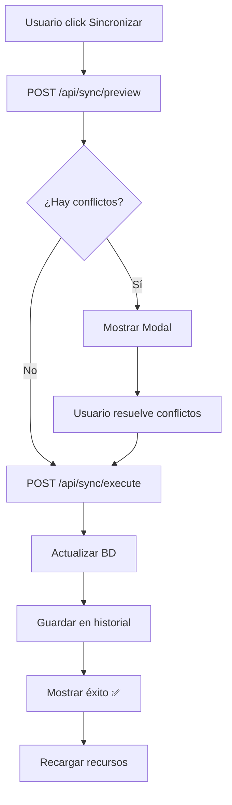

# Sincronización con Azure Cosmos DB

## 📋 Descripción

El dashboard OpenIT incluye un sistema completo de sincronización con Azure Cosmos DB que permite:

- ✅ Inicialización automática de base de datos
- ✅ Sincronización manual desde la UI
- ✅ Detección inteligente de conflictos
- ✅ Resolución de conflictos campo por campo
- ✅ Historial de sincronizaciones
- ✅ Diseño profesional y simple

## 🚀 Configuración Inicial

### 1. Variables de Entorno

Crea o actualiza tu archivo `.env.local` con la conexión a Cosmos DB:

```bash
# Azure Cosmos DB Connection String
AZURE_COSMOSDB_OPENIT=AccountEndpoint=https://tu-cuenta.documents.azure.com:443/;AccountKey=tu-key-aqui;

# Nombre de la base de datos (opcional, default: "openit")
COSMOS_DATABASE_NAME=openit

# Nivel de logging (opcional, default: "warn")
COSMOS_LOG_LEVEL=warn
```

### 2. Inicialización Automática

La base de datos se inicializa automáticamente al ejecutar la primera sincronización. No necesitas hacer nada manualmente.

La app creará estos contenedores:

1. **azure-resources** - Recursos de Azure
2. **project-participants** - Participantes de proyectos DevOps
3. **sync-history** - Historial de sincronizaciones
4. **app-config** - Configuración de la aplicación

## 💻 Uso desde la UI

### Sincronización Básica

1. Ve a http://localhost:3000/azure-resources
2. Click en el botón **"Sincronizar con BD"**
3. La app analizará cambios y mostrará un resumen

#### Sin Conflictos

Si no hay conflictos, la sincronización se ejecutará automáticamente y verás:

```
✅ Sincronización completada exitosamente
```

#### Con Conflictos

Si hay conflictos, se abrirá un modal mostrando:

```
┌──────────────────── Conflictos Detectados ────────────────────┐
│                                                                 │
│  📊 Resumen:                                                   │
│  • 5 recursos nuevos                                          │
│  • 3 recursos actualizados                                    │
│  • 0 recursos eliminados                                      │
│                                                                 │
│  ⚠️  Conflictos (3):                                           │
│                                                                 │
│  ┌─────────────────────────────────────────────────────────┐  │
│  │ ⚡ as-api-webapp-prd                                     │  │
│  │                                                           │  │
│  │ Campo: location                                          │  │
│  │                                                           │  │
│  │ ┌──────────────────┐  ┌──────────────────┐             │  │
│  │ │ ☁️  Azure        │  │ 💾 Base de Datos │             │  │
│  │ │ eastus2 ✓       │  │ eastus          │             │  │
│  │ └──────────────────┘  └──────────────────┘             │  │
│  │                                                           │  │
│  └─────────────────────────────────────────────────────────┘  │
│                                                                 │
│  [Cancelar]  [Aplicar Cambios Seleccionados]                  │
└─────────────────────────────────────────────────────────────────┘
```

### Resolución de Conflictos

Para cada campo con conflicto, puedes elegir:

- **☁️  Usar valor de Azure** (por defecto) - El valor actual de Azure sobrescribe la BD
- **💾 Usar valor de Base de Datos** - Se mantiene el valor de la BD

Simplemente haz click en la opción que desees y luego presiona **"Aplicar Cambios Seleccionados"**.

## 🔧 Arquitectura Técnica

### Estructura de Archivos

```
lib/
├── db/
│   ├── cosmos-client.ts       # Cliente singleton de Cosmos DB
│   ├── init.ts                # Inicialización automática
│   ├── schemas.ts             # Schemas Zod de validación
│   ├── queries.ts             # Queries comunes
│   └── sync-helpers.ts        # Lógica de sincronización

├── types/
│   └── database.ts            # Tipos TypeScript para BD

app/api/sync/
├── preview/route.ts           # POST /api/sync/preview
└── execute/route.ts           # POST /api/sync/execute

components/
├── sync-button.tsx            # Botón de sincronización
└── sync-conflicts-dialog.tsx  # Modal de conflictos
```

### Flujo de Sincronización



### Detección de Conflictos

Se detectan conflictos cuando un recurso existe tanto en Azure como en la BD pero tiene valores diferentes en campos clave:

- `name`, `type`, `resourceGroup`
- `location`, `subscription`
- `status`, `environment`
- `createdDate`, `gitRepository`

### ID Único

**Importante**: El ID único e irrepetible de cada recurso en la base de datos es **el nombre del recurso en Azure**.

Esto significa que:
- Si un recurso tiene el mismo nombre, se considera el mismo recurso
- Los campos que difieren se muestran como conflictos
- No se pueden tener dos recursos con el mismo nombre

## 📊 API Endpoints

### POST /api/sync/preview

Analiza cambios sin modificar la base de datos.

**Request**: Ningún body necesario

**Response**:
```json
{
  "success": true,
  "data": {
    "summary": {
      "totalResources": 10,
      "newResources": 2,
      "updatedResources": 3,
      "deletedResources": 0,
      "unchangedResources": 5,
      "conflicts": 3
    },
    "conflicts": [
      {
        "resourceId": "as-api-webapp",
        "resourceName": "as-api-webapp",
        "field": "location",
        "azureValue": "eastus2",
        "databaseValue": "eastus"
      }
    ],
    "changes": {
      "new": ["resource-1", "resource-2"],
      "updated": ["resource-3"],
      "deleted": []
    }
  },
  "timestamp": "2024-11-24T12:00:00Z"
}
```

### POST /api/sync/execute

Ejecuta la sincronización con resolución de conflictos.

**Request**:
```json
{
  "conflictResolutions": {
    "resource-name": {
      "location": "use-azure",
      "environment": "use-database"
    }
  },
  "userId": "opcional"
}
```

**Response**:
```json
{
  "success": true,
  "data": {
    "summary": {
      "totalResources": 10,
      "newResources": 2,
      "updatedResources": 3,
      "deletedResources": 0,
      "unchangedResources": 5,
      "conflicts": 0
    },
    "historyId": "sync-1732464000000"
  },
  "timestamp": "2024-11-24T12:00:00Z"
}
```

## 🔍 Consultas Comunes

### Obtener todos los recursos

```typescript
import { getAllResources } from '@/lib/db/queries'

const resources = await getAllResources()
```

### Buscar recursos con filtros

```typescript
import { queryResources } from '@/lib/db/queries'

const prodResources = await queryResources({
  environment: 'production',
  hasGitRepository: true,
  limit: 20,
})
```

### Obtener historial de sincronizaciones

```typescript
import { getSyncHistory } from '@/lib/db/queries'

const history = await getSyncHistory(10) // Últimas 10 sincronizaciones
```

### Estadísticas de la base de datos

```typescript
import { getDatabaseStats } from '@/lib/db/queries'

const stats = await getDatabaseStats()
// {
//   totalResources: 25,
//   byType: { "App Service": 10, "SQL Database": 5, ... },
//   byEnvironment: { production: 15, development: 10 },
//   withGitRepository: 20,
//   lastSync: "2024-11-24T12:00:00Z"
// }
```

## 🛠️ Desarrollo y Testing

### Reset de Base de Datos

⚠️ **Cuidado**: Esto eliminará todos los datos.

```typescript
import { resetDatabase } from '@/lib/db/init'

await resetDatabase()
```

### Verificar Estado de la BD

```typescript
import { checkDatabaseStatus } from '@/lib/db/init'

const status = await checkDatabaseStatus()
console.log(status)
// {
//   isConnected: true,
//   databaseExists: true,
//   containers: [
//     { name: "azure-resources", exists: true, itemCount: 25 },
//     ...
//   ]
// }
```

## 📝 Logs y Debugging

Los logs de sincronización aparecen en la consola del servidor:

```bash
🚀 Initializing Cosmos DB...
✅ Database ready: openit
✅ Container ready: azure-resources
✅ Container ready: project-participants
✅ Container ready: sync-history
✅ Container ready: app-config

🔍 Detecting conflicts...
⚠️  Found 3 conflicts
📋 Determining sync actions...

🔄 Executing sync actions...
  ✅ Created: new-resource-1
  ✅ Updated: existing-resource-2
  ⏭️  Skipped: unchanged-resource-3

✅ Sync completed in 2340ms
   Created: 2, Updated: 3, Deleted: 0, Skipped: 5
```

## 🎯 Best Practices

1. **Sincronización Regular**: Sincroniza después de hacer cambios importantes en Azure

2. **Revisar Conflictos**: Siempre revisa los conflictos antes de aplicar cambios masivos

3. **Backup**: Cosmos DB tiene backup automático, pero considera exportar datos críticos

4. **Monitoreo**: Revisa el historial de sincronizaciones periódicamente

5. **Permisos**: Asegúrate de que la conexión de Cosmos DB tenga permisos de lectura/escritura

## ❓ Troubleshooting

### Error: "Cannot connect to Cosmos DB"

**Causa**: Connection string inválido o sin permisos

**Solución**:
1. Verifica que `AZURE_COSMOSDB_OPENIT` esté configurado correctamente
2. Verifica permisos en Azure Portal > Cosmos DB > Keys
3. Asegúrate de que el firewall de Cosmos DB permita tu IP

### Error: "Azure resources data not found"

**Causa**: No se han ejecutado los scripts de recolección de datos

**Solución**:
```bash
cd dashboard-nextjs
./scripts/fetch-azure-resources.sh
```

### Sincronización lenta

**Causa**: Muchos recursos o conexión lenta a Cosmos DB

**Optimización**:
- Usa filtros en queries para reducir datos
- Considera aumentar RU/s en Cosmos DB temporalmente
- Revisa la ubicación geográfica de Cosmos DB (debe estar cerca)

## 📚 Referencias

- [Azure Cosmos DB Documentation](https://docs.microsoft.com/en-us/azure/cosmos-db/)
- [Cosmos DB Node.js SDK](https://www.npmjs.com/package/@azure/cosmos)
- [Zod Validation](https://zod.dev/)
- [Next.js API Routes](https://nextjs.org/docs/app/building-your-application/routing/route-handlers)
